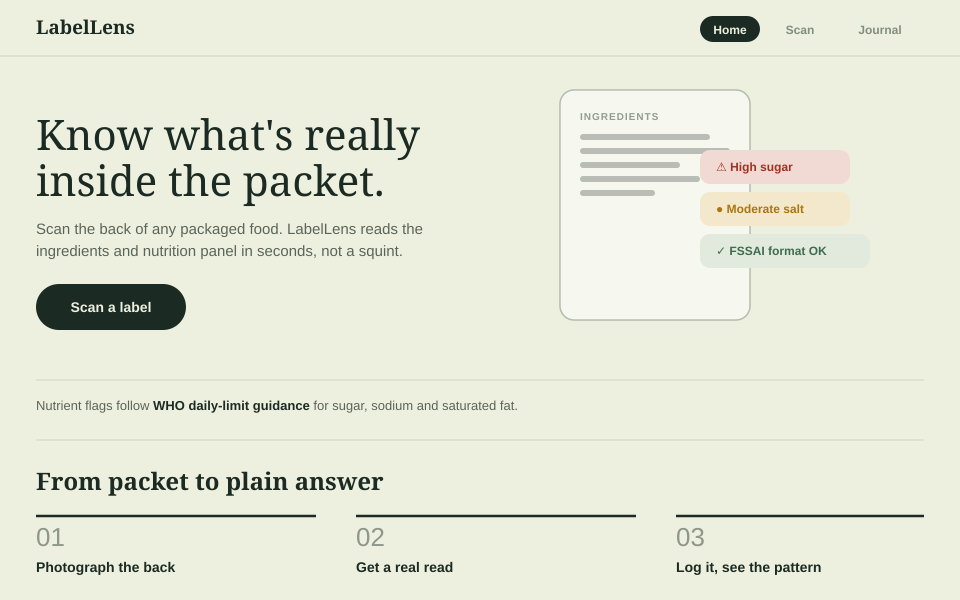
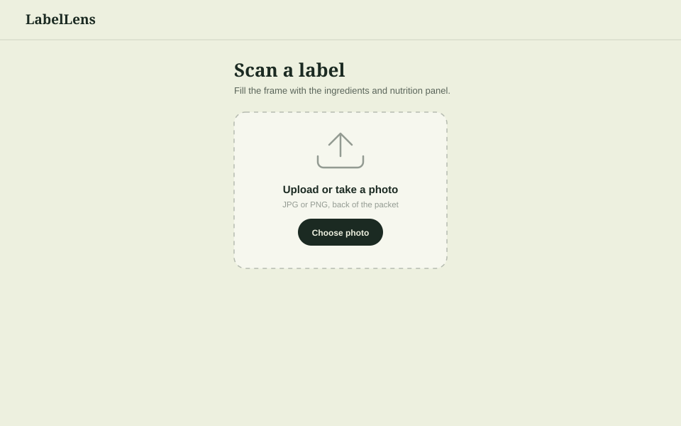
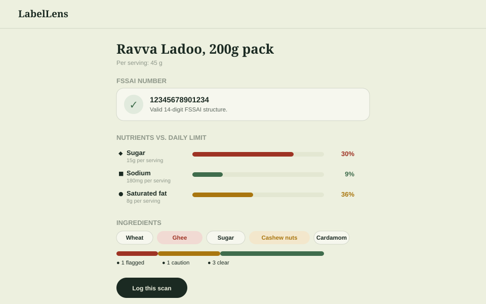
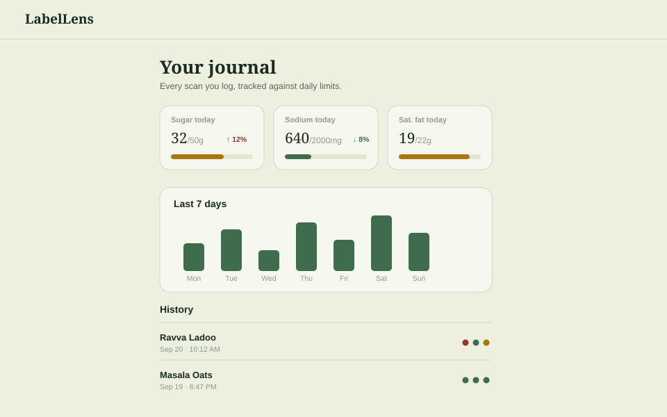
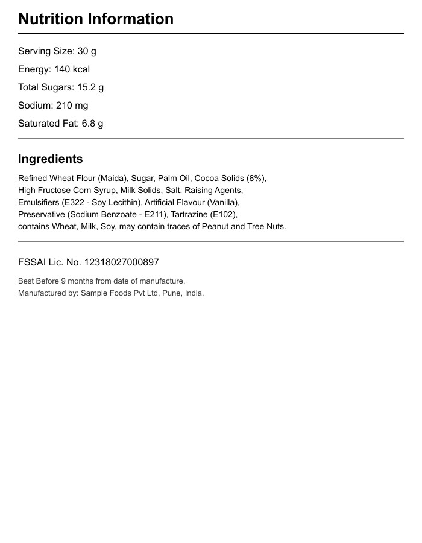
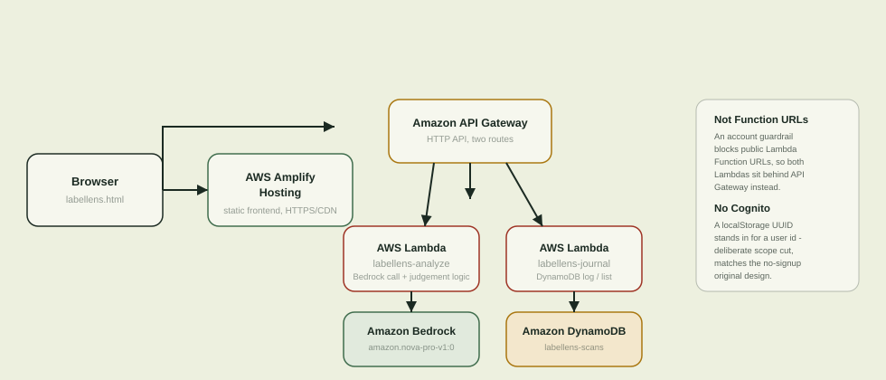

# LabelLens

Photograph the back of a packaged food product. LabelLens reads the ingredients and nutrition panel, flags what's worth knowing, and checks the FSSAI license number — in seconds.

**Live app:** https://main.decx80vwxv0uu.amplifyapp.com

Built for **First Commit** (WeMakeDevs x AWS "Bharat Builds Tour", Sept 17-20 2026) — team **paradox**.

## The problem

On Feb 10, 2026, India's Supreme Court ordered FSSAI to act on front-of-pack warning labels after a public-interest petition linking excess sugar/fat/salt to diabetes, obesity, and cardiovascular disease. FSSAI's own response (filed Aug 28, 2026) proposes red hexagonal "HIGH SUGAR"/"HIGH FAT"/"HIGH SALT" warnings — but only when a product is high in **two or more** of those three. Something dangerously high in sugar alone, unremarkable on fat and salt, gets no warning under that first phase.

Until front-of-pack labeling actually ships, consumers are stuck reading dense back-of-pack nutrition tables and squinting at 14-digit FSSAI numbers with no way to tell if the format is even valid. LabelLens closes that gap today: it flags **any single nutrient** that's high, not just combinations, and does the FSSAI structural check no one does by hand.

## What it does

1. **Scan** — photograph or upload the back of a packet.
2. **Read** — a multimodal model extracts the product name, serving size, FSSAI number, sugar/sodium/saturated-fat values, and the full ingredients list as structured JSON. Salt-to-sodium conversion and per-100g fallback are handled in the extraction prompt.
3. **Judge, deterministically** — none of the following is left to the model:
   - Nutrients are scored against WHO daily-limit guidance (sugar 50g, sodium 2000mg, sat. fat 22g per day) — under 15% of the limit reads good, 15–30% caution, over 30% high.
   - Ingredients are matched against a curated list of ~13 additive/allergen patterns (trans fats, HFCS, MSG, sulfites, common allergens, artificial colours) and tagged caution/warn.
   - The FSSAI number is checked for a valid 14-digit structure and a plausible registration-year field. Live FoSCoS registry verification (is the license *currently active*) is out of scope — that portal is CAPTCHA-protected — so this is labeled as roadmap, not faked.
4. **Log** — each scan is saved to a running nutrition journal: today's totals per nutrient, a 7-day trend, and history.

## Screens

Interface previews below — built from the app's actual CSS tokens (colors, type, spacing), not camera screenshots.

| Home | Scan |
|---|---|
|  |  |

| Results | Journal |
|---|---|
|  |  |

The **Results** screen shows the three deterministic layers stacked: the FSSAI structure check, the WHO-threshold nutrient bars (colour = tier, not a raw percentage bar), and a new **ingredient risk breakdown** — a single segmented bar showing what fraction of the ingredient list is flagged/caution/clear, so the "how bad is this list overall" read doesn't require counting chips one by one. The **Journal** screen adds day-over-day trend arrows on each nutrient card (only shown once there's a prior day to compare against, so a fresh journal doesn't show a misleading arrow from zero).

## Verified results

Real output from the deployed stack (not mocked) — this exact label, posted to the live `analyze` endpoint:



```json
{
  "servingSize": "30 g",
  "nutrientRows": [
    { "label": "Sugar",         "unit": "g",  "value": 15.2, "pct": 30, "tier": "warn" },
    { "label": "Sodium",        "unit": "mg", "value": 210,  "pct": 11, "tier": "good" },
    { "label": "Saturated fat", "unit": "g",  "value": 6.8,  "pct": 31, "tier": "warn" }
  ],
  "fssai": { "number": "12318027000897", "ok": true, "reason": "Valid 14-digit FSSAI structure." },
  "ingredients": [
    { "name": "Refined Wheat Flour (Maida)",              "flag": "caution", "why": "allergen: gluten" },
    { "name": "High Fructose Corn Syrup",                 "flag": "warn",    "why": "added sugar" },
    { "name": "Milk Solids",                               "flag": "caution", "why": "allergen: milk" },
    { "name": "Emulsifiers (E322 - Soy Lecithin)",         "flag": "caution", "why": "allergen: soy" },
    { "name": "Preservative (Sodium Benzoate - E211)",     "flag": "caution", "why": "preservative" },
    { "name": "Tartrazine (E102)",                         "flag": "caution", "why": "artificial colour" }
  ]
}
```

Every number matches the label exactly, the FSSAI prefix text got stripped down to the 14 digits correctly, and all six flaggable ingredients were caught with the right reason (unflagged ones — sugar, palm oil, cocoa solids, salt, raising agents, vanilla flavour — trimmed from this excerpt).

**One real bug this test caught, and the fix**: the first pass misread the label's explicit "Sodium: 210 mg" line as "2.10 g" and wrongly applied the salt(g)→sodium(mg) `×400` conversion meant only for labels that print salt instead of sodium — returning 840mg. The extraction prompt (`lambda/analyze/index.mjs`) now states that conversion applies *only* when there's no explicit Sodium line at all; re-tested against the same label afterward and it reads 210mg correctly. Documented here rather than hidden because it's the kind of thing that matters more shown honestly than glossed over.

The journal log/list round trip was verified against DynamoDB the same way:

| Call | Result |
|---|---|
| `POST /` `{action:"log", ...}` | `{"ok":true,"item":{...}}` — written to `labellens-scans` |
| `POST /` `{action:"list", ...}` | Returns the same item back, `ts` intact as a number |
| `OPTIONS /` (CORS preflight) | `204`, `access-control-allow-origin: *` |

### Nutrient thresholds (WHO daily-limit guidance, 2000 kcal reference)

| Nutrient | Daily limit | Good | Caution | High |
|---|---|---|---|---|
| Free sugars | 50 g | < 15% of limit/serving | 15–30% | > 30% |
| Sodium | 2000 mg | < 15% of limit/serving | 15–30% | > 30% |
| Saturated fat | 22 g | < 15% of limit/serving | 15–30% | > 30% |

These bands are LabelLens's own design choice, not an official regulatory scale — see `RESEARCH_NOTES.md` for the sourcing.

### How this compares to prior art

Researched before building, so this isn't reinventing an already-solved problem:

| Project | Stack | What it has that LabelLens doesn't (yet) |
|---|---|---|
| [NutriCheck](https://github.com/Vivek-2004/NutriCheck) | Spring Boot + Gemini | 3-tier ingredient risk labels with per-ingredient explanatory text |
| [OpenPharma](https://github.com/Mister-Ritom/openPharm) | React Native + Gemini | Barcode lookup (skips the AI call entirely for known products), health-condition-personalized A–E grade |
| [NutriScan](https://github.com/syskey8/NutriScan) | React + Tailwind + Claude | Follow-up Q&A chat, Hindi/Marathi localization |
| [BiteSmart](https://github.com/clerisy47/BiteSmart) | Kotlin + FastAPI | Dietary-profile personalized alerts, environmental-impact score |

LabelLens's differentiator: it's the only one of these enforcing WHO daily-limit math **deterministically in code**, not asked-of or estimated-by the model — and it flags on any single high nutrient, ahead of FSSAI's own proposed regulation (which only triggers on two-or-more).

## Where AWS fits



- **Amazon Bedrock** — `amazon.nova-pro-v1:0`, called via the Converse API with an image content block. The extraction prompt is the *only* place the model is trusted; every judgement call above happens in plain deterministic code, not the model.
- **AWS Lambda** — two functions. `labellens-analyze` does the Bedrock call and all three deterministic checks. `labellens-journal` reads/writes DynamoDB.
- **Amazon API Gateway (HTTP API)** — fronts both Lambdas. (Not Lambda Function URLs — this account has a guardrail that 403s public Function URLs, so API Gateway was the working path; see `deploy/DEPLOY.md` for the exact commands.)
- **Amazon DynamoDB** — single table (`userId` partition key, numeric `ts` sort key), on-demand billing. A `Query` with a `BETWEEN` range covers both "today's totals" and "last 7 days" with no secondary index.
- **AWS Amplify Hosting** — serves the static frontend over HTTPS/CDN.
- No Cognito — a `localStorage` UUID stands in for a user id, matching the original no-signup design. This is a deliberate scope cut for the hackathon window, not an oversight.

## Notable build decisions

- **Claude models on Bedrock were blocked** by a separate "Anthropic model use case" form gate (distinct from model access itself) — every invoke returned `ResourceNotFoundException` until that form clears. **Amazon Nova Pro** was verified working end-to-end instead, through the exact `tool_use` fallback path the code already had built in for when native Structured Outputs isn't supported by the model in use.
- The original prototype (`window.claude.use('sample')` / `window.claude.use('db')`, Claude.ai's own artifact runtime) was ported to AWS by swapping only those two integration points for `fetch()` calls — no frontend framework rewrite. The visual design, layout, and all client-side rendering are unchanged.
- The deterministic FSSAI/nutrient/ingredient logic moved server-side into the `analyze` Lambda, verbatim, so the AI extracts and the code judges — never the other way around.

## Repo layout

- `labellens.html` — the frontend (single static file).
- `lambda/analyze/` — Bedrock call + deterministic judgement logic.
- `lambda/journal/` — DynamoDB log/list.
- `deploy/DEPLOY.md` — full deploy runbook, including the two gotchas hit on this account (Function URL guardrail, API Gateway quick-create permission gap).
- `docs/` — interface preview images used above.
- `RESEARCH_NOTES.md` — problem evidence, thresholds used, and sources.

## Disclaimer

Nutrient flags follow WHO daily-limit guidance, not medical advice. FSSAI format checks are structural only, not a live registry lookup.
